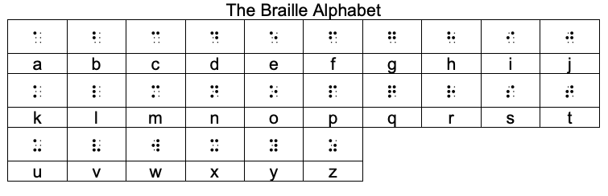
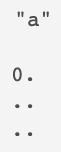
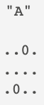

# Night Writer
---
 

## Night Writer Project Description
 

#### <i><u>Night Writer</u></i>
#### Night Writer is a program that converts an alphabetical text file, provided by the user, and translates it into a braille text file, also provided by the user. Night Writer is able to handle lowercase and uppercase letters by utilizing a braille 'switch'. Any characters outside of [a-z, A-Z, " "] will be invalidated and excluded from the translation. 
 

#### All lines of braille are limited to 40 braille characters or 80 columns - each character being two spaces wide and three spaces tall. In the event of a capital letter being the 40th letter on a line, the program will include the switch on that line and the corresponding character on the following. 
 

#### All braille characters are printed with an additional space for readability as well as an additional line break between lines. The program will create the user provided output file if it does not exist, otherwise it will rewrite the file.
 

#### <i><u>Night Reader</u></i>
#### Night Reader is a program that converts a braille text file, provided by the user, and translates it into an alphabetical text file, also provided by the user.  Night Reader is able to handle lowercase and uppercase letters by utilizing a braille 'switch'. 
 

#### All lines of alphabetical text are limited to 40 characters.  In the event of a word crossing over the 40 character limit, it will be truncated to the following line. The program will create the user provided output file if it does not exist, otherwise it will rewrite the file.
 

#### <i><u>Braille Alphabet</u></i>
 

#### <i><u>Braille Uppercase Switch</u></i>
#### The below is an uppercase 'switch' that when encountered means the following letter is capitalized:

#### The below is an example of a lowercase 'a' and uppercase 'a', differentiated by the uppercase switch:

---
 

## Installation
 

#### To install, please clone the following repository to your local machine:
[NightWriter](https://github.com/aj-bailey/Night_Writer)

---
 

## Executing
 

#### The following are steps for executing Night Writer:
1. Open your terminal
2. Navigate to root directory of the program
3. Create a `.txt` file with the alphabetical text to be translated
4. Run `night_writer_runner.rb <<i>your_file.txt</i>> <<i>your_output_file.txt</i>>
5. Open <<i>your_output_file.txt</i>> to review translation
 
 

#### The following are steps for executing Night Writer:
1. Open your terminal
2. Navigate to root directory of the program
3. Create a `.txt` file with the braille text to be translated or reuse night writer's braille output file
4. Run `night_reader_runner.rb <<i>your_file.txt</i>> <<i>your_output_file.txt</i>>
5. Open <<i>your_output_file.txt</i>> to review translation

 

---
 

## Future Goals
- Support Numbers
- Support Contractions

---
 

## Contributors
Adam Bailey <ab67319@gmail.com>; [@github.com/aj-bailey](@github.com/aj-bailey>)